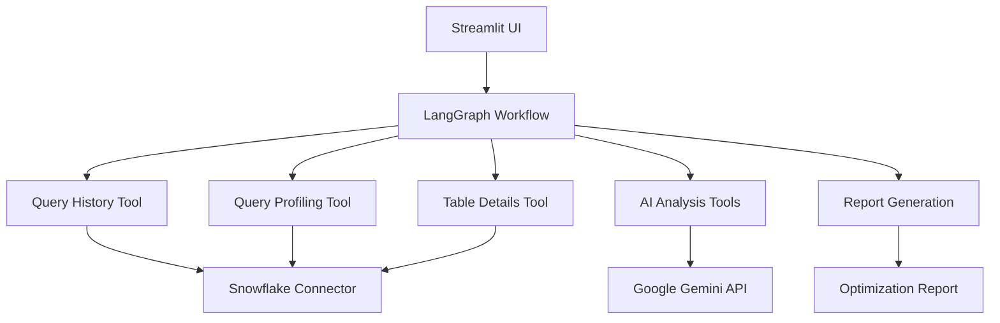

# Snowflake Performance Optimization Agent 🚀

An AI-powered SQL performance analysis and optimization tool for Snowflake data warehouses. This project uses **LangGraph** for deterministic workflow orchestration and **Google Gemini** for intelligent query analysis.

## 📋 Table of Contents

- [Overview](#overview)
- [Architecture](#architecture)
- [Features](#features)
- [Installation](#installation)
- [Configuration](#configuration)
- [Usage](#usage)
- [Project Structure](#project-structure)
- [API Reference](#api-reference)
- [Troubleshooting](#troubleshooting)
- [Contributing](#contributing)
- [License](#license)

## 🎯 Overview

The Snowflake Performance Agent is a comprehensive solution for analyzing and optimizing SQL query performance in Snowflake environments. It combines the power of AI-driven analysis with deterministic workflow orchestration to provide actionable insights and optimization recommendations.

### Key Capabilities

- **🔍 Performance Analysis**: Identifies bottlenecks in query execution using Snowflake's operator statistics
- **🤖 AI-Powered Optimization**: Uses Google Gemini to generate optimized query rewrites and infrastructure recommendations
- **📊 Interactive Dashboard**: Streamlit-based web interface for easy analysis and visualization
- **🔄 Deterministic Workflows**: LangGraph orchestration ensures consistent, repeatable analysis processes
- **✅ Semantic Validation**: Automatically validates that optimized queries produce equivalent results
- **📈 Real-time Progress**: Live progress tracking with detailed workflow status

## 🏗️ Architecture



### Core Components

1. **LangGraph Workflow Engine**: Manages deterministic execution flow
2. **Snowflake Integration**: Direct connection using generic user/password authentication
3. **AI Analysis Pipeline**: Google Gemini for intelligent performance analysis
4. **Interactive Web Interface**: Streamlit dashboard for user interaction
5. **Structured Data Models**: Pydantic models for type safety and validation

## ✨ Features

### 🚀 **LangGraph Workflow Features**
- **Deterministic Execution**: Reliable, repeatable analysis workflows
- **Sequential Processing**: Step-by-step analysis with conditional transitions
- **Reduced LLM Calls**: Optimized workflow reduces API costs
- **Error Recovery**: Robust error handling and retry mechanisms

### 📊 **Analysis Capabilities**
- **Multi-Input Support**: Analyze by Session ID, Query Tag + Date, or specific Query ID
- **Bottleneck Identification**: Pinpoint performance issues using operator statistics
- **Query Rewriting**: AI-generated optimized SQL with performance estimates
- **Infrastructure Recommendations**: Clustering, warehouse sizing, and optimization suggestions
- **Semantic Equivalence**: Validates optimized queries maintain original logic

### 🖥️ **User Interface**
- **Real-time Progress Tracking**: Live workflow status with execution times
- **Interactive Results**: Detailed analysis with expandable sections
- **Query Comparison**: Side-by-side original vs optimized query display
- **Performance Metrics**: Comprehensive bottleneck analysis and recommendations

## 🔧 Installation

### Prerequisites

- Python 3.8+
- Access to a Snowflake account
- Google Cloud account with Gemini API access

### Install Dependencies

```bash
# Clone the repository
git clone <repository-url>
cd snowflake-performance-agent

# Install required packages
pip install -r requirements.txt

# For Streamlit interface (optional)
pip install streamlit
```

### Core Dependencies

```bash
pip install langgraph google-generativeai snowflake-connector-python pydantic streamlit pandas
```

## ⚙️ Configuration

### Environment Variables

Create a `.env` file or set the following environment variables:

```bash
# Snowflake Connection (Required)
SNOWFLAKE_USER=your_username
SNOWFLAKE_PASSWORD=your_password
SNOWFLAKE_ACCOUNT=your_account_identifier
SNOWFLAKE_WAREHOUSE=your_warehouse
SNOWFLAKE_DATABASE=your_database
SNOWFLAKE_SCHEMA=your_schema

# Google Gemini API (Required)
GEMINI_API_KEY=your_gemini_api_key
```

### Configuration Details

| Variable | Description | Required |
|----------|-------------|----------|
| `SNOWFLAKE_USER` | Your Snowflake username | ✅ |
| `SNOWFLAKE_PASSWORD` | Your Snowflake password | ✅ |
| `SNOWFLAKE_ACCOUNT` | Snowflake account identifier | ✅ |
| `SNOWFLAKE_WAREHOUSE` | Default warehouse for analysis | ✅ |
| `SNOWFLAKE_DATABASE` | Default database | ✅ |
| `SNOWFLAKE_SCHEMA` | Default schema | ✅ |
| `GEMINI_API_KEY` | Google Gemini API key | ✅ |

### Snowflake Permissions

Your Snowflake user needs access to:

- `SNOWFLAKE.ACCOUNT_USAGE.QUERY_HISTORY` (for query history)
- `SNOWFLAKE.ACCOUNT_USAGE.TABLES` (for table metadata)
- `GET_QUERY_OPERATOR_STATS()` function (for query profiling)

## 🚀 Usage

### 1. Command Line Interface

```bash
# Analyze a specific session
python sf_performance_agent_langgraph.py

# The script will analyze the hardcoded session ID by default
# Edit the session_id variable in the main() function for different sessions
```

### 2. Streamlit Web Interface

```bash
# Start the web interface
streamlit run sf_performance_agent_ui.py
```

Then open your browser to `http://localhost:8501`

### 3. Programmatic Usage

```python
from sf_performance_agent_langgraph import create_langgraph_agent

# Create agent
agent = create_langgraph_agent()

# Analyze by session ID
report = agent.analyze_session_performance(session_id="12345678")

# Analyze by query tag and date
report = agent.analyze_session_performance(
    query_tag="MY_ANALYSIS_TAG", 
    start_date="2024-01-15"
)

# Analyze specific query
report = agent.analyze_session_performance(
    query_id="01abc123-4567-8901-2345-6789abcdef01"
)
```

### Analysis Methods

#### Method 1: Session ID Analysis
- Analyzes all slow queries (>3 minutes) from a specific Snowflake session
- Input: Session ID
- Best for: Analyzing performance issues in a specific user session

#### Method 2: Query Tag Analysis  
- Analyzes queries with specific tags from a given date
- Input: Query tag + Start date
- Best for: Analyzing tagged workloads or scheduled jobs

#### Method 3: Query ID Analysis
- Analyzes a specific query by its unique ID
- Input: Query ID
- Best for: Deep-diving into individual problematic queries

## 📁 Project Structure

```
snowflake-performance-agent/
├── README.md
├── requirements.txt
├── sf_performance_agent_langgraph.py    # CLI entry point
├── sf_performance_agent_ui.py           # Streamlit web interface
├── snowflake_connector.py               # Generic Snowflake connection
│
├── models/                              # Data models and schemas
│   ├── __init__.py
│   ├── data_models.py                   # Pydantic data models
│   └── schemas.py                       # JSON schemas for AI responses
│
├── tools/                               # Analysis tools
│   ├── __init__.py
│   ├── snowflake_tools.py              # Snowflake data collection tools
│   └── ai_tools.py                     # AI-powered analysis tools
│
├── workflows/                           # LangGraph workflows
│   ├── __init__.py
│   └── langgraph_workflow.py           # Main workflow orchestration
│
└── utils/                              # Utilities and constants
    ├── __init__.py
    ├── logging_utils.py                # Logging configuration
    └── constants.py                    # Optimization rules and constants
```

### Key Files Description

| File | Purpose |
|------|---------|
| [`sf_performance_agent_langgraph.py`](sf_performance_agent_langgraph.py) | Main CLI entry point and factory functions |
| [`sf_performance_agent_ui.py`](sf_performance_agent_ui.py) | Streamlit web interface with progress tracking |
| [`snowflake_connector.py`](snowflake_connector.py) | Generic Snowflake connection handler |
| [`models/data_models.py`](models/data_models.py) | Pydantic models for data validation |
| [`workflows/langgraph_workflow.py`](workflows/langgraph_workflow.py) | LangGraph workflow orchestration |
| [`tools/snowflake_tools.py`](tools/snowflake_tools.py) | Snowflake data collection tools |
| [`tools/ai_tools.py`](tools/ai_tools.py) | Google Gemini AI analysis tools |

## 📚 API Reference

### Core Classes

#### `SnowflakePerformanceLangGraphAgent`

Main agent class that orchestrates the analysis workflow.

```python
class SnowflakePerformanceLangGraphAgent:
    def __init__(self, ai_config: AIConfig, progress_callback: Optional[Callable] = None)
    def analyze_session_performance(
        self, 
        session_id: str = None,
        query_tag: str = None, 
        start_date: str = None,
        query_id: str = None,
        progress_callback: Optional[Callable] = None
    ) -> Dict[str, Any]
```

#### `SnowflakeConnector`

Generic Snowflake connection handler.

```python
class SnowflakeConnector:
    def __init__(self)  # Uses environment variables
    def get_connection(self) -> snowflake.connector.SnowflakeConnection
    def execute_query(self, query: str, params: Any = None) -> List[Dict]
```

### Workflow Tools

#### Snowflake Tools
- `QueryHistoryTool`: Fetches query history from Snowflake
- `QueryProfilingTool`: Gets detailed execution profiles
- `QueryObjectDetailsTool`: Retrieves table statistics and metadata
- `ReportGenerationTool`: Generates final optimization reports

#### AI Tools  
- `OperatorStatsAnalysisTool`: Analyzes operator statistics for bottlenecks
- `QueryPerformanceAnalysisTool`: Comprehensive performance analysis
- `OptimizedQueryGenerationTool`: Generates optimized queries and recommendations
- `QuerySemanticEvaluationTool`: Validates semantic equivalence

### Data Models

Key Pydantic models for type safety:

- `QueryInfo`: Query metadata and execution statistics
- `QueryProfile`: Detailed profiling information
- `Bottleneck`: Performance bottleneck representation
- `OptimizationRecommendation`: Query optimization suggestions
- `InfrastructureChange`: Infrastructure-level recommendations
- `OptimizationReport`: Complete analysis report

## 🔍 Troubleshooting

### Common Issues

#### **"Failed to connect to Snowflake"**
- Verify environment variables are set correctly
- Check network connectivity to Snowflake
- Ensure user has proper permissions

#### **"Gemini API call failed"**  
- Verify `GEMINI_API_KEY` is valid
- Check API quota and billing status
- Review network connectivity to Google APIs

#### **"No slow queries found"**
- This is normal if no queries exceed the 3-minute threshold
- Try different time ranges or query tags
- Consider lowering the execution time threshold

#### **Missing Dependencies**
```bash
# Install all requirements
pip install langgraph google-generativeai snowflake-connector-python streamlit pandas pydantic

# Or use requirements file
pip install -r requirements.txt
```

### Logging

The application uses comprehensive logging. Set log level in code:

```python
import logging
from utils.logging_utils import setup_logging

logger = setup_logging(log_level=logging.DEBUG)
```

### Performance Tips

1. **Large Result Sets**: Use `limit` parameter in query history fetch
2. **API Rate Limits**: Add delays between AI calls if needed
3. **Memory Usage**: Process queries in batches for large workloads
4. **Network Timeouts**: Adjust timeout values for slow connections


### Testing

```bash
# Run tests (when available)
pytest

# Code formatting
black .

# Linting
flake8 .

# Type checking
mypy .
```

## 🙏 Acknowledgments

- **LangGraph**: For workflow orchestration framework
- **Google Gemini**: For AI-powered analysis capabilities
- **Snowflake**: For the robust data platform and operator statistics
- **Streamlit**: For the interactive web interface framework

---

**Built with ❤️ for the Snowflake community**
